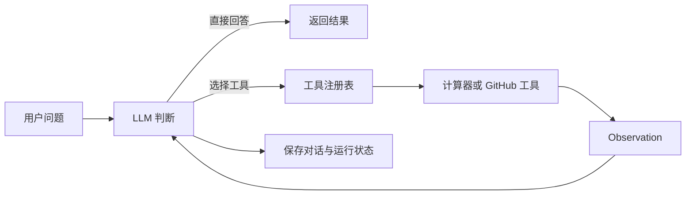

# AI Learning Road

一个记录我从 Python 基础走向 AI Agent 开发的学习仓库。

这个仓库不是单一成品项目，而是一条可回顾的学习路线：从变量、循环和函数开始，逐步练习文件存储、面向对象、API 调用，最后实现一个带工具调用、对话记忆和运行状态的简易 Agent。

## 学习路线

| 阶段 | 主要内容 | 代表代码 |
|---|---|---|
| Python 基础 | 输入输出、数据类型、条件、循环、列表和字典 | `python/hello.py`、`python/guess_number.py` |
| 函数与异常 | 参数、返回值、异常处理、模块拆分 | `python/function_test.py`、`python/finally_test.py` |
| 面向对象 | 类、继承、多态和方法重写 | `python/oop_test.py`、`python/inheritance_test.py` |
| 小型项目 | 多个版本的任务管理器和 JSON 持久化 | `python/task_manager_oop_v2/` |
| API 入门 | 使用 `requests` 查询 GitHub 公共 API | `python/github_api.py`、`python/api_test.py` |
| AI Agent | LLM、Tools、Memory、Loop 和运行状态 | `python/Day30/` |

## Agent 是怎样工作的



`python/Day30/` 中包含：

- `ai_service.py`：Agent 主循环、模型调用和工具执行。
- `tool_registry.py`：统一注册可调用工具。
- `tool_schema.py`：告诉模型工具名称和参数格式。
- `tools/`：计算器和 GitHub 查询工具。
- `memory.py`：保存与加载对话历史。
- `agent_state.py`、`state_memory.py`：记录 Agent 当前运行状态。

相关的白话学习总结见 [`notes/AI-Agent-白话笔记.md`](notes/AI-Agent-白话笔记.md)。

## 快速开始

### 1. 创建环境并安装依赖

```powershell
python -m venv .venv
.\.venv\Scripts\Activate.ps1
pip install -r requirements.txt
```

### 2. 配置模型密钥

复制 `.env.example` 为 `.env`，然后只在本地填写：

```env
DEEPSEEK_API_KEY=你的密钥
```

`.env` 已加入 `.gitignore`，不要把真实密钥提交到 GitHub。

### 3. 运行简易 Agent

```powershell
cd python\Day30
python main.py
```

输入“退出”即可结束程序。Agent 运行时产生的 `memory.json`、`agent_state.json` 和任务数据不会提交到仓库。

## 我学到的工程习惯

- 将工具定义、执行逻辑和模型调用拆分到不同模块。
- 使用环境变量保存 API Key，不在代码中硬编码密钥。
- 使用 JSON 保存早期版本的任务和对话状态。
- 为工具参数设计明确的数据结构，减少模型输出不稳定。
- 记录 Agent 的思考、工具调用和结果状态，方便定位问题。

## 当前限制

- 这是学习型实现，不适合直接用于生产环境。
- Agent 依赖外部模型 API，运行前需要自行配置密钥。
- JSON 记忆适合个人练习；数据量增加后应迁移到数据库。
- 工具参数仍由提示词约束，后续可升级为模型原生 Tool Calling。

## 下一步

- 为 Agent 核心流程增加自动测试。
- 使用 Pydantic 校验工具参数和模型输出。
- 增加结构化日志与错误分类。
- 将学习成果沉淀为独立的 AI 应用作品集。

## 仓库定位

这是我的学习过程档案。完整作品集项目请查看 [AI Compass](https://github.com/Mut1y/ai-compass)。
